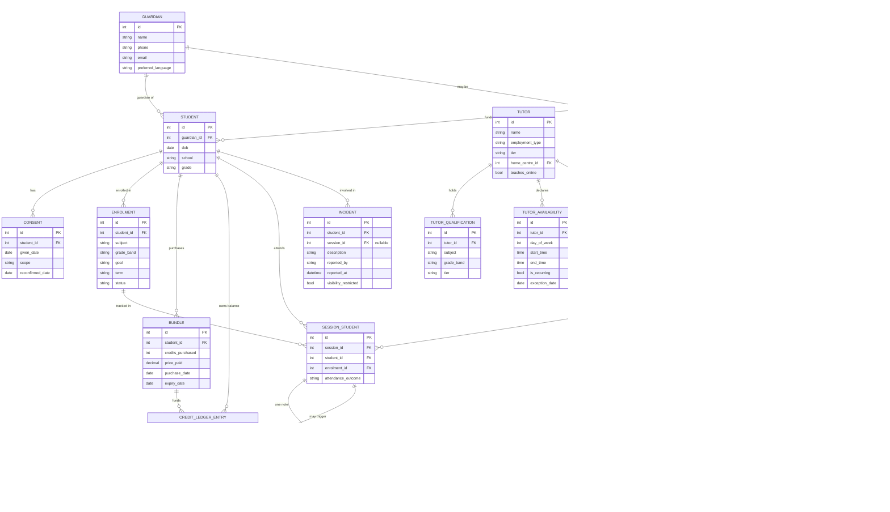

# Artifact 11 — Entity-Relationship Diagram

BrightPath Learning · release 1 data model

## Design decisions on the four §9.3 traps

1. **Multi-student session, per-student progress note.** `Session` holds shared facts (tutor, time,
   mode, centre). `SessionStudent` links each enrolled student to the session and carries their own
   attendance outcome. `ProgressNote` is 1:1 with `SessionStudent`, not with `Session` — a 4-student
   group session can have up to 4 notes; BR-07 (attendance + note before the credit is deducted)
   applies per student.
2. **Nullable centre.** `Session.centre_id` is nullable for `mode = 'online'`. Reports grouped by
   centre (§9.5) bucket NULL as a synthetic "Online" group in the query layer, not as a fake centre row.
3. **Credit balance: derived, not stored.** `CreditLedgerEntry` is append-only (BR-09); balance is
   `SUM(amount)` per student, materializable later if read performance demands it (view `v_credit_balance`
   below). No column is ever overwritten — a correction is a new signed entry.
4. **Invoice payer, two kinds.** `Payer` is a supertype with `payer_type` and exactly one of
   `guardian_id` / `district_contract_id` populated (enforced by CHECK). `Invoice.payer_id → Payer`.
   E-7 (funding ends mid-bundle) creates a new `Payer` row and future invoices point to it; past
   ledger entries are untouched.

## Diagram

`AuditLog` and `TutorAvailability`'s recurring/exception split aren't drawn with relationship lines
above (they reference many tables generically / one table respectively) — see the DDL for their
actual foreign keys and the trigger that populates `AuditLog` automatically on ledger writes.
