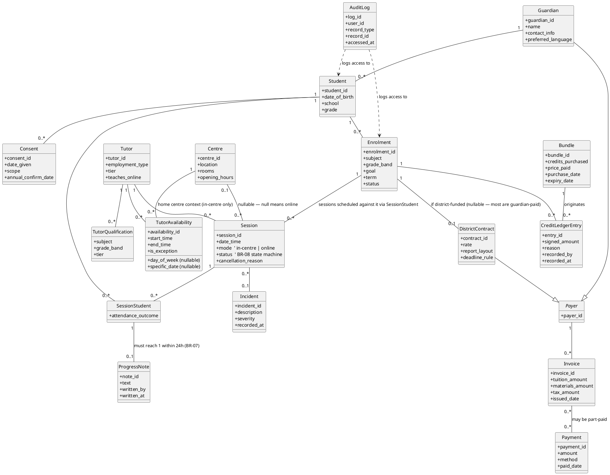
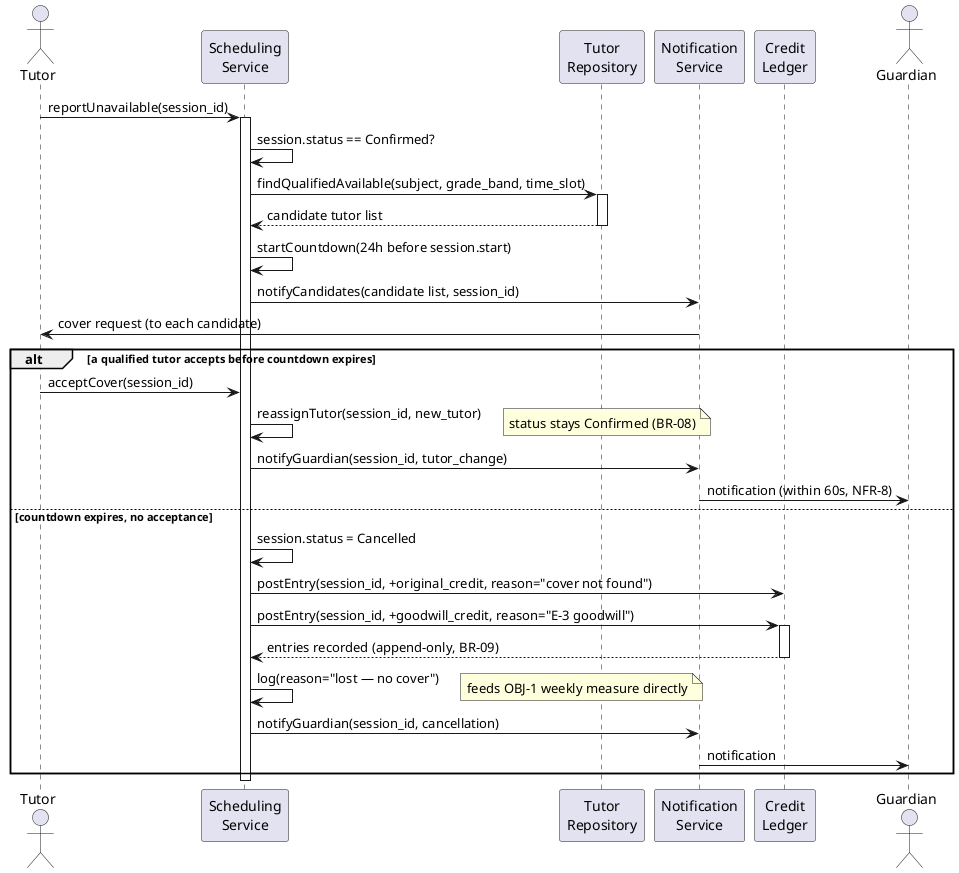
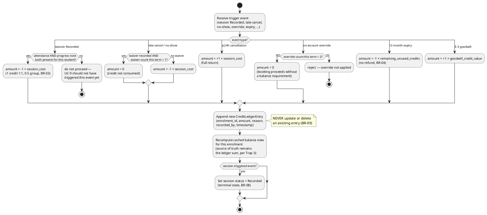

# UML as Code — BrightPath Learning

Three diagrams, each earning its place rather than restating the BPMN: the **class diagram** resolves the
four data-model traps §9.3 explicitly calls out; the **sequence diagram** shows the tutor-cover flow at
the message level (the BPMN in artifact #5 shows it as a business process, this shows who calls whom); the
**activity diagram** shows the credit-deduction algorithm's internal logic, which the BPMN deliberately
left as a black box (see artifact #5's closing note).

## 1. Class diagram — resolving the four §9.3 traps

## 2. Sequence diagram — Tutor Cover Flow (E-3 / UC-8)

Message-level view of the same flow the BPMN sub-flow (artifact #5 §2) shows as a business process.

## 3. Activity diagram — Credit Deduction Algorithm (UC-10 internals)

The BPMN treated `UC-10 Deduct Credit` as a single opaque step (artifact #5's closing note says exactly
this). Here's what's actually inside it.

## Cross-checks for the reviewer

- The class diagram's `SessionStudent`→`ProgressNote` cardinality (`0..1`, "must reach 1 within 24h")
  should match FR-040/FR-041 in the SRS and the BPMN's BR-07 timer — three artifacts describing one rule
  from three angles; if any of them disagree, one of them is wrong.
- The sequence diagram's `alt` branches map directly to Gherkin scenarios D2/C3 in the backlog (artifact
  #7) — same two outcomes, same trigger, different notation.
- The activity diagram's `switch` cases are exactly the reason codes the SQL (artifact #12) will need to
  `GROUP BY` when answering "outstanding credit liability" and "credits expiring in 60 days" — worth
  confirming the reason strings used here match what ends up in the actual schema (artifact #11).
