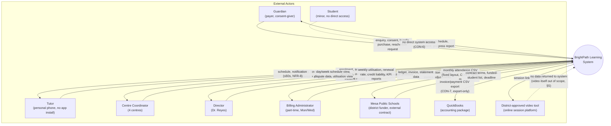

# Context Diagram — BrightPath Learning System

Level-0 (system context): the system as one box, every external actor that sends or receives something
across its boundary, and what crosses in each direction.

## Notes on the boundary

- **Student** has a dotted line: they exist in the data model (as the subject of sessions and progress
  notes) but have no login and send/receive nothing directly, per CON-6 and §4 ("not consulted").
- **QuickBooks** and the **video tool** are one-way at the system boundary by design (CON-7: export only,
  no write-back; §5: video platform itself is out of scope) — the diagram shows no return arrow from
  either, which is the point, not an omission.
- **Mesa Public Schools** is the only external actor whose interface shape is a hard, unnegotiable
  constraint (CON-5) rather than something the team designs — worth calling out explicitly in the SRS
  when this diagram is referenced.
- This is intentionally system-level (Level-0). Which internal component talks to Mesa or QuickBooks
  (a scheduled job vs. an on-demand export button) is a design decision for the sequence diagrams
  (artifact #9), not this diagram.
