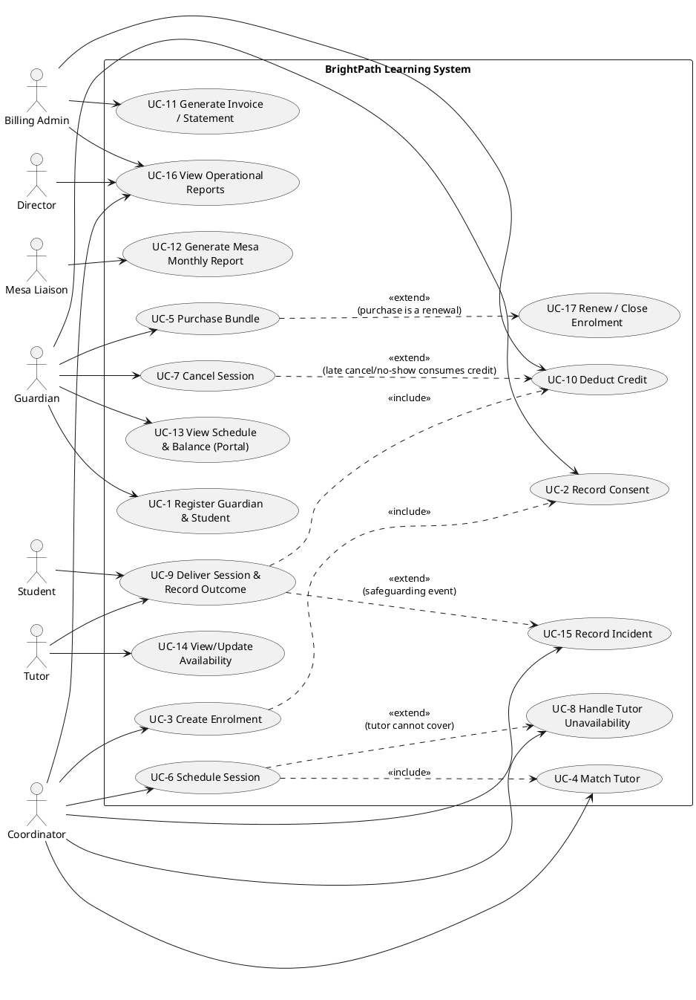

# Use Cases — BrightPath Learning

## 1. Use case diagram

Only the relationships that earn `include`/`extend` are shown as such — most use cases stand alone.
`include` is used only where a sub-flow is *mandatory and reused* by more than one use case; `extend` only
where a sub-flow is *optional and conditional*.

## 2. Fully dressed specs — primary use cases

Only the use cases with real branching or a rule dependency worth reviewing are written in full below;
the rest (UC-1, UC-2, UC-11, UC-13, UC-14, UC-16, UC-17) are one-paragraph summaries at the end, since the
brief's grading rewards depth on the ones that carry the golden thread, not uniform padding on all 17.

---

### UC-3: Create Enrolment
**Actor:** Coordinator. **Includes:** UC-2 (Record Consent) — mandatory, cannot enrol without it.
**Trace:** OBJ-4, BR-12, CON-6.

**Preconditions:** Student and guardian exist in the system (UC-1 complete).

**Main flow:**
1. Coordinator opens new enrolment for an existing student.
2. System checks whether valid, current-year consent exists (BR-12).
3. If not, system triggers UC-2 (`include`) before allowing the enrolment to proceed.
4. Coordinator enters subject, grade band, and a written goal.
5. System creates enrolment with status Active, linked to the current term.

**Alternate flow A3-1 — consent exists but is not yet annually re-confirmed:**
2a. System flags consent as due for renewal.
2b. Coordinator cannot complete enrolment until UC-2 is re-run for the new year.

**Postconditions:** Enrolment exists with a goal (feeds §9.5's "students with no progress note in 30
days" report and OBJ-4's 100% target).

---

### UC-4: Match Tutor
**Actor:** Coordinator. **Included by:** UC-6. **Trace:** BR-01, OBJ-6, §10 (deferred AI candidate).

**Main flow:**
1. Coordinator requests a tutor match for an enrolment's subject/grade band.
2. System filters tutors by `TutorQualification` matching subject + grade band + required tier (BR-01 —
   SAT prep requires certified tier).
3. System further filters by declared availability overlapping the requested time.
4. Coordinator selects from the qualified, available list (today: from memory: §2 step 2; release 1: from
   this filtered list).

**Alternate flow A4-1 — no qualified tutor available:**
3a. System returns an empty list.
3b. Coordinator either widens the time search or flags unmet demand — this is exactly the input to the
    §9.5 "demand vs. qualified tutor capacity" report; an empty result here is data, not just a dead end.

**Note:** this use case is the manual, rule-based baseline that §10's AI tutor-matching candidate would
augment, not replace — the spec in artifact #16 must justify why a suggestion beats this filtered list.

---

### UC-6: Schedule Session
**Actor:** Coordinator. **Includes:** UC-4. **Extended by:** UC-8. **Trace:** BR-02, BR-03, BR-06, BR-08,
NFR-7, OBJ-2.

**Main flow:**
1. Coordinator selects a matched, available tutor (UC-4 `include`) and a time slot.
2. System checks BR-02: tutor not already booked; if group, ≤4 students, one subject, one grade band.
3. System checks BR-06: student's credit balance ≥ session cost (1 credit one-to-one, 0.5 group).
4. System creates session, status = Scheduled (BR-08).
5. System notifies tutor and guardian within 60 seconds (NFR-8).

**Alternate flow A6-1 — insufficient balance (BR-06):**
3a. System blocks booking.
3b. Coordinator may record an on-account override, if fewer than 2 have been used this student this term.
3c. If override recorded, booking proceeds; ledger records the override as its own entry type (BR-09).

**Extension point — tutor cannot cover:** if, after confirmation, the assigned tutor reports unavailable,
UC-8 (`extend`) takes over; UC-6 does not model that branch itself (see BPMN sub-flow, artifact #5 §2).

**Non-functional tie-in:** a coordinator must be able to complete this use case for a full week, one
centre, in ≤20 minutes after 3 hours of training (NFR-7) — this is a usability acceptance criterion on
this use case specifically, not a system-wide average.

---

### UC-8: Handle Tutor Unavailability
**Actor:** Coordinator (system-assisted). **Extends:** UC-6. **Trace:** E-3, OBJ-1, R-5.

**Main flow:**
1. Tutor reports inability to cover a Confirmed session.
2. System searches qualified, available tutors (same filter as UC-4) and starts a 24-hour-to-session
   timer.
3. System notifies candidate tutors of the open cover slot.
4. A qualified tutor accepts; system reassigns the session, keeps status Confirmed, notifies guardian of
   the tutor change.

**Alternate flow A8-1 — no cover found before the 24-hour timer expires:**
2a. System cancels the session (status = Cancelled, BR-08).
2b. System returns the original credit *and* issues a goodwill credit (E-3).
2c. System logs the event as "lost — no cover," which is the exact numerator of the OBJ-1 weekly measure.

**Design note tied to R-5:** this use case's data (which tutors decline, how often) is capacity-planning
input for §9.5's utilisation report — the SRS and the UI must be explicit that individual decline/accept
history is not surfaced as a per-tutor scorecard, to avoid the surveillance reading tutors are likely to
give it.

---

### UC-9: Deliver Session & Record Outcome
**Actor:** Tutor (primary), Student (participant, no direct system action). **Includes:** UC-10.
**Extended by:** UC-15. **Trace:** BR-07, BR-08, BR-13, NFR-6.

**Main flow:**
1. Tutor delivers the session.
2. Tutor records attendance per student in the session.
3. Tutor records one progress note per student (not one per session — §9.2).
4. If both recorded within 24 hours, system triggers UC-10 (`include`) to deduct credit and set session
   status = Recorded (terminal, BR-08).

**Alternate flow A9-1 — online session fails technically (E-9):**
1a. Tutor or system marks the session as a technical failure.
1b. Session does not count as delivered; credit is returned, not consumed; explicitly logged as not a
    no-show.

**Alternate flow A9-2 — student does not attend (E-2/no-show):**
2a. Tutor marks student absent.
2b. UC-10 still triggers, but deducts the credit per BR-05 (no-show consumes credit) rather than after a
    completed delivery — same include, different rule branch inside it.

**Extension point — safeguarding/behaviour event:** if an incident occurs during delivery, UC-15
(`extend`) is triggered independently of whether the session otherwise completes normally; a session can
be simultaneously Recorded and have an associated Incident.

**Access control tie-in (BR-13, NFR-6):** the tutor recording this can only see their own assigned
students; every record access here is logged.

---

### UC-10: Deduct Credit
**Actor:** System (invoked, not directly initiated by a human actor). **Included by:** UC-9, UC-7.
**Trace:** BR-04, BR-05, BR-09.

**Main flow:**
1. Receive a triggering event (session Recorded, late cancellation, no-show, override, expiry) with a
   signed credit amount and reason.
2. Append a new `CreditLedgerEntry` — never edit or delete an existing one (BR-09).
3. Recompute the student's current balance (see artifact #9.3 discussion — whether this is a live query
   over the ledger or a maintained running total is a data-model decision made once and applied
   consistently here).

**This use case has no alternate flows of its own** — because it's always invoked from inside another use
case's rule branch, every "alternate" is really the calling use case's alternate flow (A6-1, A9-2, A7-1,
etc.) choosing a different reason code and amount before calling in. Modelling branches here too would
just duplicate them.

---

### UC-12: Generate Mesa Monthly Report
**Actor:** System (scheduled), Mesa Coordinator (reviews before send). **Trace:** CON-5, NFR-9, OBJ-7,
BR-11.

**Main flow:**
1. On a monthly schedule (or on-demand), system pulls attendance records for all district-funded students
   for the reporting month.
2. System formats the output to the exact contracted CSV layout (CON-5 — fixed, not configurable by the
   team).
3. Mesa coordinator reviews for completeness before submission.
4. Report delivered within 2 business days of month end (NFR-9).

**Alternate flow A12-1 — a funded student's funding ended mid-month (E-7):**
1a. System includes attendance only up to the funding-end date for that student; sessions after that date
    bill the guardian and are excluded from this export.

**Explicit exclusion (BR-11):** this use case never includes progress notes, regardless of format — that
constraint is enforced at the query level, not left to reviewer discretion.

---

## 3. Summary use cases (one paragraph each)

- **UC-1 Register Guardian & Student.** Coordinator captures guardian contact details, preferred language
  (NFR-10), and student date of birth/school/grade. No branching beyond basic validation; feeds UC-2 and
  UC-3 downstream.
- **UC-2 Record Consent.** Coordinator or guardian records consent scope and date; system computes the
  annual re-confirmation deadline (BR-12). Included by UC-3; re-triggered yearly per student.
- **UC-11 Generate Invoice/Statement.** Billing admin (or system, scheduled) produces a guardian-facing
  statement combining untaxed tuition and taxed materials (BR-10) against the ledger; a district-funded
  student's invoice instead routes to UC-12's data feed rather than a guardian statement.
- **UC-13 View Schedule & Balance (Portal).** Guardian views upcoming sessions and current balance
  (NFR-1: <2s load) and requests a reschedule, which creates a coordinator task rather than auto-approving
  — the portal proposes, it doesn't execute UC-6 or UC-7 directly.
- **UC-14 View/Update Availability.** Tutor sets recurring weekly availability and one-off exceptions from
  a phone browser (CON-3, no app); this is the direct input to UC-4's filter and the single biggest lever
  on A-4 (assumption that tutors keep it current).
- **UC-15 Record Incident.** Coordinator (or tutor, reported to coordinator) logs a behaviour or
  safeguarding incident; visibility restricted to director-only per E-8/NFR-5, a stricter access rule than
  BR-13's normal centre-level visibility.
- **UC-16 View Operational Reports.** Director/coordinator/billing admin view the §9.5 report set, each
  scoped by BR-13 (a coordinator sees their centre only; only the director sees all four plus online).
- **UC-17 Renew/Close Enrolment.** Triggered at bundle exhaustion (extended by UC-5 when the answer is
  "buy more") or at student exit; closing an enrolment preserves its history rather than deleting it,
  consistent with E-6's "closed, not deleted" rule for goal changes.
